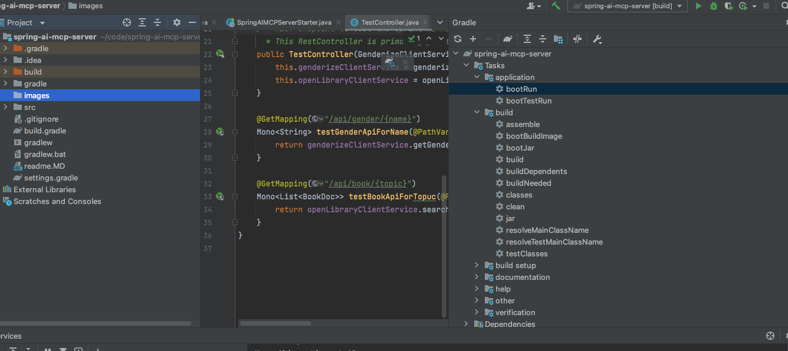

Spring AI MCP Server with External API Tools
This Spring Boot application demonstrates how to integrate external APIs as AI tools using Spring AI. It currently exposes two tools:

1. **Gender Prediction Tool (using Genderize.io)**

2. **Book Search Tool (using Open Library API)**

## Tools Available

### 1. `getGenderForName` (Genderize.io)

* **Description:** Get the predicted gender for a given name using the Genderize.io API. Returns 'male', 'female', or null if the gender cannot be predicted.

* **API Endpoint:** `https://api.genderize.io/`

* **Usage Example ():** "What is the gender of John?", "Is Sarah male or female?"

### 2. `searchBooks` (Open Library API)

* **Description:** Search for books by title using the Open Library Search API. Returns a list of book titles and their first publish year.

* **API Endpoint:** `https://openlibrary.org/search.json`

* **Usage Example (via AI Chat):** "Find books titled 'The Lord of the Rings'", "Search for a book called 'Pride and Prejudice'"

**Run the Spring Boot Application and test:**

Build and Run

**Test**

curl  http://localhost:8081/sse

